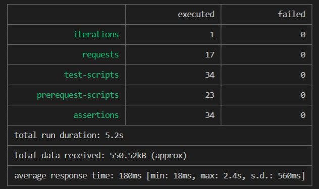
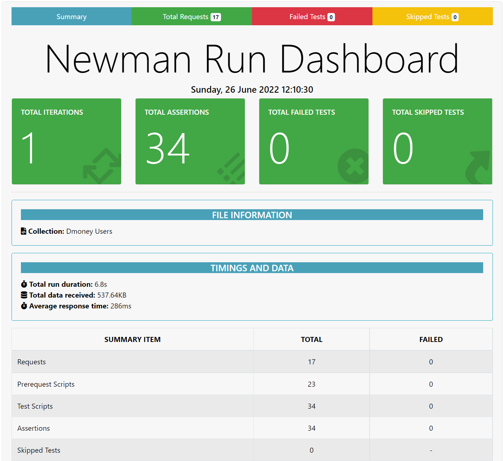

# Dmoney User API Testing

- #### [API testing Postman Collection](https://www.getpostman.com/collections/a5b149ce6a23590068eb)

- #### [API testing Postman Documentation](https://documenter.getpostman.com/view/15644992/UzBsGjDT)

### **How to run this project**

### **Clone From**:

```
git clone https://github.com/ratnakarmaker/dmoney-user-api-testing-newman.git
```
#### **Then You need to install and build this repository on your PC**.
```
npm i
```

#### For Collection Run:
```
npx newman run .collection/collection.json
```



#### For Report Generate:
```
node report.js
```
#### **Preview of Newman Report**


